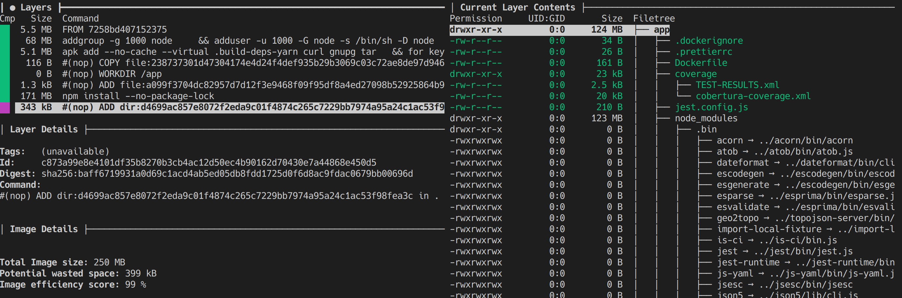
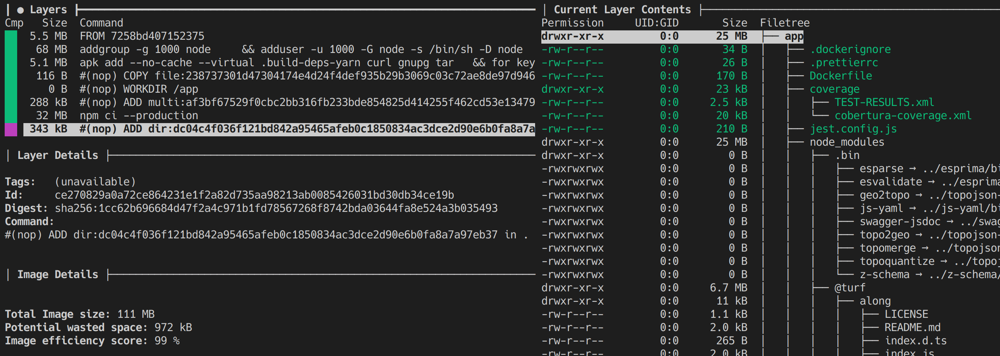
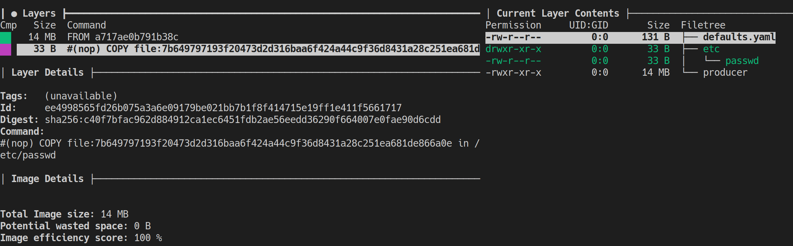

# Improving our development pipeline

---

Warning we **go**t a **go** fanboy here 😉 

---

## Reducing human error

---

### Better config loading

- Clean typed config
- Validation
  - Missing variables
  - Legacy variables
  - Type/content
- Support multiple config files

___

🤩
``` go
package config

// Config contains all the configuration variables for this service
type Config struct {
	LogLevel string `validate:"required"`
	HTTPPort uint16 `validate:"required"`
	Kafka    Kafka
}

// Kafka contains the config for kafka
type Kafka struct {
	Brokers             []string `validate:"gt=0,dive,hostname_port"`
	ClientID            string   `validate:"lowercase,printascii"`
	LocationOutputTopic string   `validate:"required,lowercase,printascii"`
}
```
___

default.yaml

``` yaml
logLevel: debug
httpPort: 8080
kafka:
  brokers: kafka:9092
  clientID: producer
  locationOutputTopic: locations
```
production.yaml

``` yaml
logLevel: info
kafka:
  brokers: kafka-prod:9092
```
___

```
make run
INFO[0000] Starting producer version: v0.1.0:master     
FATA[0000] Failed to load config: 
Key: 'Config.Kafka.Brokers[0]' Error:Field validation for 'Brokers[0]' failed on the 'hostname_port' tag
Key: 'Config.Kafka.ClientID' Error:Field validation for 'ClientID' failed on the 'lowercase' tag
Key: 'Config.Kafka.LocationOutputTopic' Error:Field validation for 'LocationOutputTopic' failed on the 'required' tag
```

___

```
INFO[0000] Using config: {"LogLevel":"debug","HTTPPort":326,"Kafka":{"Brokers":["kafka:9092"],"ClientID":"producer","LocationOutputTopic":"locations.test"}} 
```

---

### Difference between local and the clusters

___

1. No docker compose
2. Helm charts

___

* k3s
* Less scripts
* Permanent kafka instance

---

Reduce image size


___

🤠


___

😏


---

### Flat folder structure

___

`project-folder/images/service/src`

* Legacy
* npm install... 😩
  

---

## Documentation

---

Shared model library

___

* Folder with kafka message payloads
* Folder with api responses

---

[Go docs](https://k3s/pkg)


---

No JSON schemas but swagger

---

Go does a lot for you

---

Want to try it out?
* https://github.com/Polygens/models
* https://github.com/Polygens/consumer
* https://github.com/Polygens/producer
